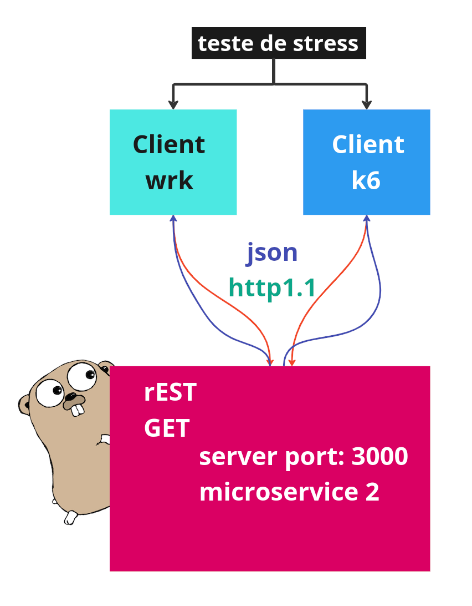

# Cenário Client Server

Neste diretório encontra-se os microservices 2, temos até o momento 4 services que responde o GET e retornam JSON utilizando http1.1.
Fizemos o teste de stress com os 4 serviços e cada um encontra-se em seu diretório.

Usamos duas ferramentas para medir o k6 e wrk.

